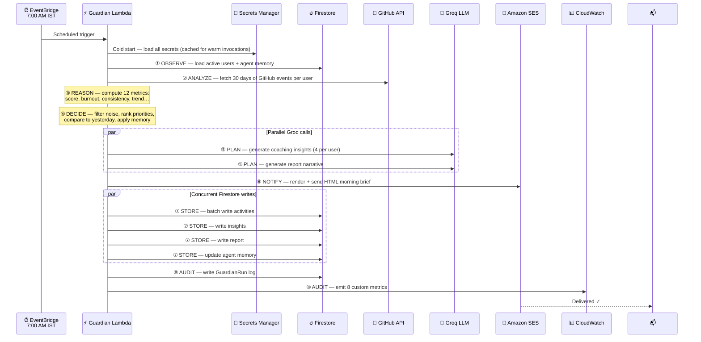
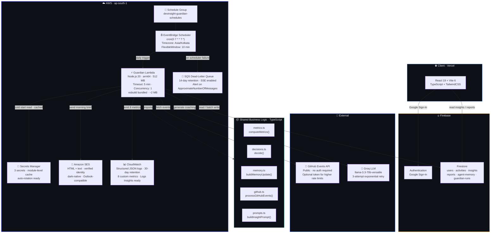

<div align="center">

<br/>


<br/><br/>

# DevInsight Guardian

### *The AI Engineering Manager that works while you sleep.*

**An autonomous, serverless agent that watches your GitHub activity overnight,
decides what actually matters today, and delivers a personalized morning brief —
written like advice from a senior engineering manager — before your first coffee.**

<br/>

> **"Your dashboard has 47 charts. You checked it twice last quarter."**
>
> *DevInsight Guardian checks it for you. Every single day. At 7:00 AM.*

<br/>

[](infrastructure/template.yaml)
[](https://builderscenter.aws)
[](https://nodejs.org)
[](https://react.dev)

</div>

---

## Table of Contents

- [The Problem](#the-problem-with-developer-productivity-tools)
- [Introducing Guardian](#introducing-devinsight-guardian)
- [Quick Start](#quick-start)
- [Screenshots](#screenshots)
- [How It Works](#how-it-works)
- [How Guardian Decides](#how-guardian-decides)
- [Architecture](#architecture)
- [Features](#features)
- [AWS Services](#aws-services-used)
- [Project Structure](#project-structure)
- [Getting Started](#getting-started)
- [Environment Variables](#environment-variables)
- [Deployment](#deployment)
- [Security](#security)
- [Monitoring](#monitoring--observability)
- [Cost Estimate](#cost-estimate)
- [Roadmap](#roadmap)
- [Contributing](#contributing)
- [License](#license)

---

## The Problem with Developer Productivity Tools

Developer productivity dashboards are everywhere.
They count commits, plot velocity, track cycle time.
They're beautiful. They're comprehensive. **And they're almost entirely ignored.**

Here's why: dashboards are passive. They wait for you to care.

But you're in the middle of a sprint. You have pull requests to review, incidents to handle, and a standup in 20 minutes. Checking your "productivity insights" never makes it to the top of your to-do list — not today, not tomorrow, not this sprint.

Meanwhile, the data that could help you is sitting idle:

- Your **burnout signal** has been climbing for two weeks. Nobody flagged it.
- Your **most impactful repository** is being neglected. Nobody noticed.
- Last week's coaching recommendation **actually worked** — your consistency improved. Nobody acknowledged it.
- You've had **three late-night commit sessions** in five days. Nobody connected the dots.

The problem isn't the data. **The problem is that no one is watching it for you.**

Passive dashboards put the burden on the developer. Guardian flips that entirely.

---

## Introducing DevInsight Guardian

Guardian is not a dashboard. It is an **autonomous AI Engineering Manager** that:

1. **Observes** your GitHub activity every night while you sleep
2. **Analyzes** 30 days of patterns — commits, burnout signals, repository trends
3. **Reasons** about what the numbers actually mean
4. **Decides** what deserves your attention today (and explicitly ignores what doesn't)
5. **Plans** a coaching strategy — shaped by agent memory and yesterday's outcomes
6. **Notifies** you via a premium morning brief — an email, not a report
7. **Stores** everything — building a persistent memory of your engineering patterns
8. **Audits** itself — logging every decision, emitting 8 CloudWatch metrics per run

It runs at **7:00 AM IST** every day. You read it with your coffee. You know exactly what to focus on. You move on.

No dashboards to check. No plugins to remember to open. No noise to filter.

**Just a clear, prioritized, personalized brief — every morning.**

---

## Quick Start

> Assumes AWS CLI configured, Firebase project created, and SES identity verified.

```bash
# 1. Clone and install
git clone https://github.com/your-username/devinsight.git && cd devinsight
npm install && cp .env.example .env  # fill in Firebase credentials

# 2. Create the three required Secrets Manager secrets (see Getting Started for details)
#    devinsight/firebase-service-account
#    devinsight/groq-api-key
#    devinsight/ses-config

# 3. Update SesFromEmail in infrastructure/samconfig.toml, then deploy
cd infrastructure && sam build && sam deploy
```

Guardian wakes up at 7:00 AM IST. Your first brief arrives the next morning.

---

## Screenshots

### Morning Brief Email

> Dark-native HTML email delivered to Gmail, Outlook, and Apple Mail.
> Above the fold: productivity score with progress bar, burnout risk card, weekly trajectory, and today's #1 priority with priority/confidence/reason.


### DevInsight Dashboard

> React + Vite frontend showing 30-day activity chart, burnout trend line, and repository breakdown.


*Add your own screenshots to `docs/screenshots/` after deployment.*

---

## How It Works



### The 8-Stage Pipeline

| # | Stage | What Happens | If It Fails |
|:--|:------|:-------------|:------------|
| ① | **OBSERVE** | Load GitHub-connected users + agent memory from Firestore | Skip invalid users, continue |
| ② | **ANALYZE** | Fetch 30 days of GitHub Events API data | Fall back to simulated events |
| ③ | **REASON** | Compute 12 metrics — score, burnout, trend, consistency, cadence | Pure logic, never fails |
| ④ | **DECIDE** | Apply agent memory, filter noise, rank top 3 recommendations | Deterministic, never fails |
| ⑤ | **PLAN** | Call Groq in parallel — 4 insights + narrative report | Template fallback, continue |
| ⑥ | **NOTIFY** | Build HTML email, send via SES | Log failure, continue pipeline |
| ⑦ | **STORE** | Concurrent Firestore writes — activities, insights, report, memory | Log partial failure, continue |
| ⑧ | **AUDIT** | Write GuardianRun log + emit CloudWatch metrics | Non-fatal, silently logged |

> **Isolation guarantee:** A failure for one user never aborts the pipeline for others.
> `Promise.allSettled` is used throughout. The handler always returns a result — it never throws.

---

## How Guardian Decides

The **DECIDE** stage is what separates Guardian from a reporting pipeline. It's where the agent exercises judgment.

Guardian applies five rules, in order:

```
1. ESCALATE  — If burnout is High, this overrides everything else.
               The top recommendation becomes a wellbeing intervention.

2. CELEBRATE — If productivity improved >15% week-over-week AND burnout is Low,
               acknowledge the win explicitly before giving new advice.

3. SPOTLIGHT — Identify the repository with the highest recent activity.
               At least one recommendation must reference it specifically.

4. FILTER    — Ignore anything with confidence < 60%.
               Never give advice you're not reasonably sure about.

5. LIMIT     — Recommend exactly 3 actions. Never more.
               An overwhelmed developer ignores everything.
```

**Agent Memory** makes decisions better over time:

```
Run N:    "Block 2 hours of focus time in the morning."
          → Stored in Firestore: { recommendation: "focus block", metrics_snapshot: {...} }

Run N+1:  Guardian loads yesterday's recommendation.
          Compares today's metrics to yesterday's snapshot.

          If consistency improved → "Yesterday's focus block worked. Let's protect it."
          If metrics unchanged   → "Let's try a different approach — pair programming instead."
          If metrics worsened    → Escalate urgency. Change strategy. Say so explicitly.
```

This is the difference between an analytics platform and an advisor.

---

## Architecture



### Architecture Decisions

| Decision | What Was Chosen | Why Not The Alternative |
|:---------|:----------------|:------------------------|
| **Compute** | Lambda (serverless) | ECS/EC2 — 24h idle cost for a 60s/day job |
| **CPU architecture** | arm64 (Graviton) | x86_64 — arm64 is 20% faster, 50% cheaper at same memory |
| **LLM provider** | Groq | OpenAI — Groq is 10–20× faster; critical for multi-user runs within 5-min timeout |
| **Database** | Firestore | RDS/DynamoDB — Firebase Auth integration, no VPC required, schema-flexible |
| **Secrets** | Secrets Manager | Parameter Store / env vars — auto-rotation support; values never appear in CF state |
| **Networking** | No VPC | VPC — Lambda doesn't need private networking here; VPC adds cold start latency and NAT Gateway cost |
| **Scheduling** | EventBridge Scheduler | EventBridge Rules / CloudWatch Events — Scheduler is timezone-aware, has built-in DLQ and retry |
| **Concurrency** | `ReservedConcurrentExecutions: 1` | Unlimited — EventBridge guarantees at-least-once; concurrency cap prevents duplicate runs |

---

## Features

```
✦ Autonomous daily analysis        No dashboards. No triggers. Runs while you sleep.
✦ 8-stage agentic pipeline         OBSERVE → ANALYZE → REASON → DECIDE → PLAN → NOTIFY → STORE → AUDIT
✦ Agent memory & strategy shifts   Yesterday's outcomes influence today's coaching approach
✦ Burnout early warning            Late-night + weekend patterns flagged before they escalate
✦ Priority · Confidence · Reason   Every recommendation carries all three — no naked suggestions
✦ Adaptive urgency                 Subject line, email design, and tone adapt to your risk level
✦ Repository spotlighting          Identifies which project deserves focus today
✦ Progress acknowledgement         Celebrates when advice worked; changes strategy when it didn't
✦ Premium HTML morning brief       Dark-native email tested on Gmail · Outlook · Apple Mail
✦ Groq LLM with exponential retry  3-attempt backoff; narrative template fallback if unavailable
✦ Parallel LLM calls               Insights + report generated simultaneously, not sequentially
✦ Concurrent Firestore writes      All 4 STORE writes run in Promise.allSettled — no sequential blocking
✦ Warm-start secret caching        Secrets Manager loaded once per Lambda lifecycle; subsequent calls use cache
✦ Zero-ops infrastructure          Serverless, event-driven, ~$1.52/month for 10 developers
✦ 100% TypeScript, strict mode     No implicit any. Result<T> monad. The handler never throws.
✦ Dependency-injectable services   Every external call sits behind an interface — fully mockable
✦ Structured JSON logging          All logs CloudWatch Logs Insights compatible from day one
```

---

## AWS Services Used

| Service | Role in Guardian | Why This Service |
|:--------|:----------------|:-----------------|
| **Lambda** | Runs the 8-stage agentic pipeline | Serverless; zero cost when not running; 5-min timeout covers all users |
| **EventBridge Scheduler** | 7:00 AM IST daily trigger | Native timezone support; flexible window; built-in retry + DLQ |
| **SES** | Morning brief delivery | High deliverability; $0.10/1K emails; AWS-native |
| **Secrets Manager** | Firebase, Groq, and SES credentials | Auto-rotation ready; values never in Lambda env or CF state |
| **CloudWatch Logs** | Structured JSON execution logs | Native integration; Logs Insights queryable |
| **CloudWatch Metrics** | 8 custom operational metrics | Alarm-ready; free tier covers low-volume runs |
| **SQS (DLQ)** | Catches scheduler invocation failures after retries | 14-day retention; SSE included at no cost |
| **IAM** | Execution role + scheduler role | Least-privilege; namespace-conditioned metrics; resource-scoped secrets |
| **SAM** | Infrastructure as code + build | Native esbuild TypeScript support; one-command deployment |

---

## Project Structure

```
devinsight/
│
├── src/                              # React 19 + Vite 6 frontend (TypeScript)
│   ├── components/                   # Reusable UI components
│   ├── pages/                        # Route-level pages (Dashboard, Login, etc.)
│   ├── services/                     # Firebase/Firestore client-side calls
│   ├── layouts/                      # Page layout wrappers
│   └── lib/                          # Shared frontend utilities
│
├── shared/                           # ⭐ Zero-I/O business logic — no SDKs, no network
│   ├── types.ts                      # All shared TypeScript interfaces
│   ├── metrics.ts                    # computeMetrics() — 12 productivity signals
│   ├── decisions.ts                  # decide() — 5-rule DECIDE stage + memory comparison
│   ├── memory.ts                     # buildMemoryUpdate() + assessProgress()
│   ├── github.ts                     # processGitHubEvents() + generateSimulatedEvents()
│   ├── groq.ts                       # Groq invocation wrapper + response parsing
│   └── prompts.ts                    # All LLM prompt templates (coaching, insights, report)
│
├── lambda/
│   └── guardian/                     # The autonomous agent
│       ├── index.ts                  # Handler — orchestration only, zero business logic
│       ├── types.ts                  # Lambda-specific interfaces (UserRecord, Secrets, …)
│       ├── package.json              # firebase-admin dep; @aws-sdk/* excluded (runtime-provided)
│       ├── tsconfig.json             # Strict mode + path alias @shared → ../../shared
│       ├── utils/
│       │   ├── result.ts             # Result<T,E> monad — ok(), err(), tryAsync(), partitionResults()
│       │   └── logger.ts             # StructuredLogger + StageTimer → CloudWatch Logs Insights JSON
│       └── services/                 # External dependency wrappers (all injectable via interfaces)
│           ├── secretsService.ts     # AWS Secrets Manager — parallel fetch, module-level cache
│           ├── firestoreService.ts   # Firebase Admin — IFirestoreService, chunked batch writes
│           ├── githubService.ts      # GitHub Events API — IGitHubService, rate limit classification
│           ├── groqService.ts        # Groq LLM — IGroqService, exponential retry, narrative fallback
│           ├── sesService.ts         # Amazon SES — ISesService, email masking in logs
│           ├── cloudwatchService.ts  # CloudWatch — 8 metrics in one PutMetricData call
│           └── emailBuilder.ts       # Pure HTML email builder — table-based, inline CSS, Outlook-safe
│
├── infrastructure/
│   ├── template.yaml                 # AWS SAM template — 9 resources, least-privilege IAM
│   └── samconfig.toml                # One-command deploy config (no interactive prompts)
│
├── firestore.rules                   # Firestore security rules (user-scoped access)
├── vercel.json                       # Vercel frontend deployment config
├── .env.example                      # Frontend environment variable template
├── package.json                      # Frontend dependencies (React, Vite, TailwindCSS)
└── tsconfig.json                     # Root TypeScript config
```

> **Key invariant:** `shared/` is the only place business logic lives. It has zero I/O, imports no SDKs, and makes no network calls. Every function in `shared/` is testable with `node --test` — no AWS credentials, no database, no network required.

---

## Getting Started

### Prerequisites

| Tool | Version | Install |
|:-----|:--------|:--------|
| Node.js | ≥ 20 | [nodejs.org](https://nodejs.org) |
| AWS CLI | ≥ 2.15 | [aws.amazon.com/cli](https://aws.amazon.com/cli) |
| AWS SAM CLI | ≥ 1.110 | [docs.aws.amazon.com/serverless-application-model](https://docs.aws.amazon.com/serverless-application-model/latest/developerguide/install-sam-cli.html) |
| esbuild | ≥ 0.20 | Installed automatically via `npm install` |
| Firebase CLI | ≥ 13 | `npm install -g firebase-tools` |
| Git | any | [git-scm.com](https://git-scm.com) |

You'll also need accounts on:
- **AWS** (free tier covers all Guardian costs)
- **Firebase** (free Spark plan is sufficient)
- **Groq** (free tier at [console.groq.com](https://console.groq.com))
- **Amazon SES** (verify one email identity — free)

### Step 1 — Clone and install dependencies

```bash
git clone https://github.com/your-username/devinsight.git
cd devinsight
npm install
```

### Step 2 — Configure the frontend

```bash
cp .env.example .env
```

Edit `.env` with your Firebase web SDK credentials (from Firebase Console → Project Settings → General):

```env
VITE_FIREBASE_API_KEY=AIza...
VITE_FIREBASE_AUTH_DOMAIN=your-project.firebaseapp.com
VITE_FIREBASE_PROJECT_ID=your-project-id
VITE_FIREBASE_STORAGE_BUCKET=your-project.appspot.com
VITE_FIREBASE_MESSAGING_SENDER_ID=1234567890
VITE_FIREBASE_APP_ID=1:1234:web:abcd
```

### Step 3 — Run the frontend locally

```bash
npm run dev
# → http://localhost:5173
```

### Step 4 — Create the three Secrets Manager secrets

Guardian never reads credentials from environment variables. All secrets are loaded from Secrets Manager at runtime.

**Firebase service account** (download from Firebase Console → Project Settings → Service Accounts → Generate new private key):

```bash
aws secretsmanager create-secret \
  --name devinsight/firebase-service-account \
  --secret-string file://serviceAccount.json \
  --region ap-south-1
```

**Groq API key** (from [console.groq.com/keys](https://console.groq.com/keys)):

```bash
aws secretsmanager create-secret \
  --name devinsight/groq-api-key \
  --secret-string '{"apiKey":"gsk_YOUR_GROQ_KEY"}' \
  --region ap-south-1
```

**SES + dashboard config** (email must be verified in SES):

```bash
aws secretsmanager create-secret \
  --name devinsight/ses-config \
  --secret-string '{
    "fromEmail": "guardian@yourdomain.com",
    "fromName": "DevInsight Guardian",
    "dashboardUrl": "https://devinsight.vercel.app"
  }' \
  --region ap-south-1
```

### Step 5 — Test the Lambda locally

Create `infrastructure/events/scheduled.json`:

```json
{
  "id": "test-guardian-local",
  "version": "0",
  "source": "aws.scheduler",
  "detail-type": "Scheduled Event",
  "time": "2025-07-18T01:30:00Z",
  "region": "ap-south-1",
  "detail": {}
}
```

Then build and invoke:

```bash
cd infrastructure
sam build
sam local invoke GuardianFunction --event events/scheduled.json
```

> `sam local invoke` uses Docker to simulate the Lambda runtime. It makes real calls to Secrets Manager, Firestore, GitHub, and Groq. Use a dedicated Firebase development project to keep test data separate from production.

---

## Environment Variables

### Lambda (set by SAM template — no manual configuration required)

| Variable | Value | Notes |
|:---------|:------|:------|
| `FIREBASE_SECRET_NAME` | `devinsight/firebase-service-account` | Points to the Firestore admin credentials secret |
| `GROQ_SECRET_NAME` | `devinsight/groq-api-key` | Points to the Groq API key secret |
| `SES_SECRET_NAME` | `devinsight/ses-config` | Points to email + dashboard URL config |
| `NODE_ENV` | `production` | Enables production-mode structured logging |

Secrets are loaded once per Lambda lifecycle and cached in module scope. A warm invocation pays zero additional Secrets Manager API cost.

### Frontend (`.env` file or Vercel environment settings)

| Variable | Purpose |
|:---------|:--------|
| `VITE_FIREBASE_API_KEY` | Firebase web SDK initialization |
| `VITE_FIREBASE_AUTH_DOMAIN` | Firebase Authentication |
| `VITE_FIREBASE_PROJECT_ID` | Firestore reads |
| `VITE_FIREBASE_STORAGE_BUCKET` | Firebase Storage |
| `VITE_FIREBASE_MESSAGING_SENDER_ID` | Firebase Cloud Messaging |
| `VITE_FIREBASE_APP_ID` | Firebase App identification |

> **Note:** The frontend only uses Firebase web SDK credentials — these are safe to expose in client-side code. The Firebase Admin service account (used by Lambda) never touches the frontend.

---

## Deployment

### Deploy to AWS (production)

```bash
# 1. Edit infrastructure/samconfig.toml
#    Set SesFromEmail to your verified SES email address

# 2. Build the TypeScript Lambda with esbuild
cd infrastructure
sam build
# → Bundles index.ts → index.js, excludes @aws-sdk/* (provided by Node.js 20 runtime)
# → Output: .aws-sam/build/GuardianFunction/ (~2 MB)

# 3. Deploy (no interactive prompts)
sam deploy
# → Creates/updates CloudFormation stack: devinsight-guardian
# → Provisions: 9 AWS resources in ap-south-1
```

### Deploy the frontend (Vercel)

```bash
vercel --prod
# Configure environment variables in Vercel Dashboard → Settings → Environment Variables
```

### Update an existing deployment

```bash
cd infrastructure
sam build && sam deploy
# SAM detects the changeset and applies only the diff — no downtime
```

### Tear down

```bash
sam delete --stack-name devinsight-guardian
# Preserves CloudWatch Log Group (DeletionPolicy: Retain) — logs survive stack deletion
```

---

## Security

Guardian was designed with the [AWS Well-Architected Security Pillar](https://docs.aws.amazon.com/wellarchitected/latest/security-pillar/welcome.html) as a first-class requirement — not a post-launch addition.

### IAM — Least Privilege in Practice

The Lambda execution role has **exactly four policies**, each scoped to the narrowest possible resource:

| Policy | Actions | Resource Scope |
|:-------|:--------|:---------------|
| `CloudWatchLogs` | `CreateLogStream`, `PutLogEvents` | Specific log group ARN only — `CreateLogGroup` intentionally excluded |
| `CloudWatchMetrics` | `PutMetricData` | `Resource: *` (AWS requirement) + `Condition: cloudwatch:namespace = DevInsight/Guardian` |
| `SecretsManagerRead` | `GetSecretValue` | Three specific secret ARN prefixes — trailing `*` covers the AWS-appended random suffix |
| `SESSendEmail` | `SendEmail` | One specific verified identity ARN — parameterized from `samconfig.toml` |

### Confused Deputy Protection

Both IAM roles (Lambda execution and EventBridge Scheduler) use `aws:SourceAccount` conditions in their trust policies:

```yaml
Condition:
  StringEquals:
    aws:SourceAccount: !Ref AWS::AccountId
```

This prevents cross-account service impersonation attacks where a third-party AWS service might try to assume your role.

### Secrets Philosophy

```
Code  → never              # No API keys in source files
Env   → never              # No secrets in Lambda environment variables
CF    → never              # No SecureString parameters that appear in stack state
                           ──────────────────────────────────────────────────
Secrets Manager → always   # Loaded at cold start, cached in module scope, auto-rotation ready
```

### Firestore Access Model

The **frontend** uses Firebase Authentication + Firestore security rules — users can only read and write their own data:

```javascript
// firestore.rules — enforced server-side by Firestore
match /users/{uid} {
  allow read, write: if request.auth != null && request.auth.uid == uid;
}
match /insights/{doc} {
  allow read: if request.auth != null && resource.data.uid == request.auth.uid;
}
```

The **Lambda** uses a Firebase Admin service account loaded from Secrets Manager. Admin SDK bypasses security rules by design — this is expected and correct for server-side writes.

### Schedule Group Isolation

Guardian's EventBridge Schedules are placed in a dedicated `AWS::Scheduler::ScheduleGroup` — isolated from the default group. This prevents naming conflicts and provides clean IAM scope in shared AWS accounts.

---

## Monitoring & Observability

### CloudWatch Metrics

Every Guardian run emits 8 metrics under the `DevInsight/Guardian` namespace:

| Metric | Unit | Recommended Alarm |
|:-------|:-----|:-----------------|
| `ExecutionCount` | Count | Alert if value = 0 (missed morning run) |
| `UsersProcessed` | Count | Alert on significant drop (users may be deleted from Firestore) |
| `InsightsGenerated` | Count | Alert if 0 (Groq may be unavailable) |
| `EmailsSent` | Count | Alert if 0 (SES misconfigured or identity not verified) |
| `ExecutionDuration` | Milliseconds | Alert if > 240,000 ms (approaching 5-min timeout) |
| `ExecutionFailures` | Count | Alert on any positive value |
| `GroqFallbacks` | Count | Alert on sustained high count (Groq health issue) |
| `GitHubRateLimitHits` | Count | Alert to trigger GitHub token rotation |

### CloudWatch Logs Insights Queries

All logs are structured JSON. Start with these queries:

```sql
-- All stage timings for a specific user in the last 24 hours
fields @timestamp, stage, durationMs, uid
| filter ispresent(stage) and uid = "USER_ID_HERE"
| sort @timestamp asc

-- Failed stages across all users
fields @timestamp, uid, stage, error.message
| filter ispresent(error)
| sort @timestamp desc
| limit 50

-- Average PLAN stage duration (Groq latency trend)
filter stage = "PLAN"
| stats avg(durationMs) as avgGroqMs by bin(1h)
```

### DLQ Monitoring

If the EventBridge Scheduler fails to invoke Lambda after 2 retries within 1 hour, the event lands in the SQS Dead-Letter Queue. Create a CloudWatch Alarm on `ApproximateNumberOfMessagesVisible > 0` for the DLQ to get paged on missed morning runs.

---

## Cost Estimate

Guardian is designed to be **nearly free at small scale**. All figures are for `ap-south-1` (Mumbai), July 2025 pricing.

### Monthly cost — 10 developers

| Service | Usage Assumption | Monthly Cost |
|:--------|:----------------|:------------|
| Lambda | 31 invocations × 60s avg × 512MB × arm64 | ~$0.02 |
| EventBridge Scheduler | 31 invocations | $0.00 (free tier) |
| Amazon SES | 310 emails (10 users × 31 days) | ~$0.03 |
| Secrets Manager | 3 secrets × $0.40 | $1.20 |
| CloudWatch Logs | ~50 MB/month ingest | ~$0.03 |
| CloudWatch Metrics | 8 custom metrics | ~$0.24 |
| SQS (DLQ) | Minimal message volume | $0.00 |
| **Total** | | **≈ $1.52 / month** |

### Scaling projection

| Team Size | Notes | Monthly Cost |
|:----------|:------|:------------|
| 1–10 | As above | ~$1.52 |
| 11–50 | Lambda duration increases; SES scales linearly | ~$3.50 |
| 51–100 | Consider raising Lambda memory to 1 GB and timeout to 10 min | ~$7.00 |
| 100+ | Profile per-user duration; consider parallel Lambda invocations per user | TBD |

> **arm64 vs x86_64:** Guardian uses arm64 throughout. At this scale the saving is $0.004/month — trivial in absolute terms but an important architectural signal. arm64 also has lower carbon footprint per compute unit.

---

## Roadmap

Guardian ships working core functionality. These are the next chapters:

- [x] 8-stage autonomous pipeline (OBSERVE → AUDIT)
- [x] Agent memory and strategy adaptation
- [x] Priority / Confidence / Reason on every recommendation
- [x] Premium HTML morning brief (Gmail + Outlook + Apple Mail)
- [x] AWS SAM one-command deployment with least-privilege IAM
- [x] Dead-letter queue + CloudWatch observability (8 metrics)
- [ ] **Slack / Teams integration** — Morning brief as a DM or channel message
- [ ] **Multi-timezone support** — Per-user delivery time preferences stored in Firestore
- [ ] **Team intelligence** — Cross-team patterns: who's overloaded, who can help
- [ ] **Pull request analysis** — Review velocity, stale PR detection, review load balance
- [ ] **GitHub Copilot correlation** — Connect AI-assisted sessions to productivity metrics
- [ ] **Custom coaching goals** — User-configurable objectives ("improve my consistency score")
- [ ] **Weekly digest** — Sunday evening summary with month-to-date narrative
- [ ] **Webhook mode** — Real-time dashboard update when Guardian run completes
- [ ] **Multi-region deployment** — SAM template parameterized for any AWS region

---

## Contributing

Guardian is built for engineers, by engineers. All levels of contribution are welcome.

### First Time?

Start with issues labeled [`good first issue`](https://github.com/your-username/devinsight/labels/good%20first%20issue).
Each one is scoped to a single file, includes acceptance criteria, and links to the relevant shared module.

### Development Workflow

```bash
# 1. Fork the repository
# 2. Clone your fork
git clone https://github.com/YOUR_USERNAME/devinsight.git

# 3. Create a feature branch
git checkout -b feature/slack-integration

# 4. Make changes — all TypeScript, strict mode enforced
# 5. Verify zero TypeScript errors
npx tsc --noEmit                     # root (frontend)
cd lambda/guardian && npx tsc --noEmit  # Lambda

# 6. Open a pull request with:
#    - What problem does this solve? (one paragraph)
#    - What AWS services or external calls does it add?
#    - What new environment variables or secrets are required?
#    - Does it change the shared/ module contracts?
```

### Architecture Rules for Contributors

Read these before writing any code. They're not suggestions.

| Rule | Reason |
|:-----|:-------|
| **`shared/` must stay I/O-free** | If you import an SDK in `shared/`, every unit test now needs AWS credentials |
| **Every external call goes through a service interface** | Direct SDK calls in `index.ts` break dependency injection and make tests impossible |
| **Return `Result<T, Error>`, never throw** | Thrown exceptions escape the user-level try/catch; they can abort the entire Lambda run |
| **Log `stageStart` and `stageEnd` for every new stage** | Duration tracking is how we detect performance regressions in CloudWatch |
| **Add a CloudWatch metric for every new failure mode** | Silent failures are invisible failures; observability is a feature, not a nice-to-have |
| **Per-user failure must not abort other users** | Use `Promise.allSettled`, never `Promise.all`, for multi-user loops |

### Running Tests

```bash
# Business logic tests (no AWS credentials required)
node --test shared/metrics.test.ts
node --test shared/decisions.test.ts

# Lambda handler integration test (requires Secrets Manager + Firestore)
cd infrastructure && sam local invoke GuardianFunction --event events/scheduled.json
```

---

## License

MIT License — Copyright © 2025 Shardul Kolekar

Permission is hereby granted, free of charge, to any person obtaining a copy of this software to use, copy, modify, merge, publish, distribute, sublicense, and/or sell copies of the Software, subject to the following conditions: the above copyright notice and this permission notice shall be included in all copies or substantial portions of the Software.

**THE SOFTWARE IS PROVIDED "AS IS"** — see the [LICENSE](LICENSE) file for the complete text.

---

<div align="center">

**Built for the [AWS Builder Center Weekend Agent Challenge 2025](https://builderscenter.aws)**

<br/>

*If Guardian helped you understand your own engineering patterns,*
*or sparked an idea for your own autonomous agent — leave a ⭐*

<br/>

**Made with intent in Pune, India 🇮🇳**

*by [Shardul Kolekar](https://github.com/your-username)*

</div>
